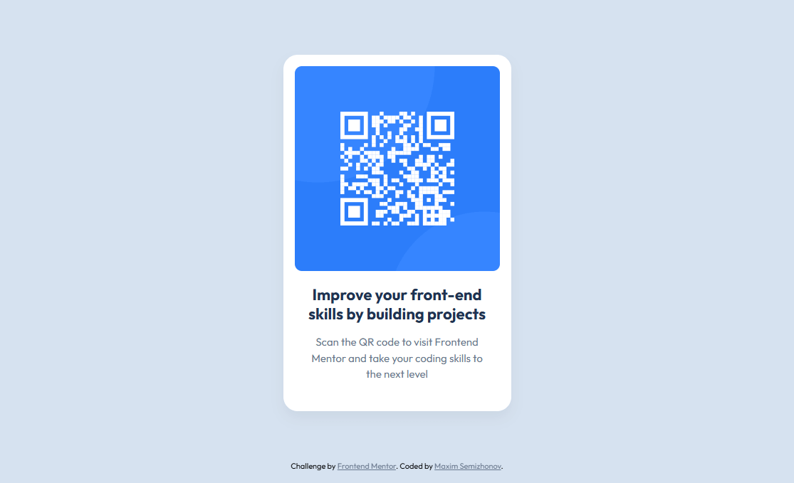

# Frontend Mentor - QR code component solution

This is a solution to the [QR code component challenge on Frontend Mentor](https://www.frontendmentor.io/challenges/qr-code-component-iux_sIO_H).

## Table of contents

- [Overview](#overview)
  - [Screenshot](#screenshot)
  - [Links](#links)
- [My process](#my-process)
  - [Built with](#built-with)
  - [What I learned](#what-i-learned)
  - [Continued development](#continued-development)
  - [Useful resources](#useful-resources)
- [Author](#author)

## Overview

### Screenshot
| Mobile | Desktop |
|----------------|------------------|
|  |  |

### Links

- Solution URL: [GitHub Repository](https://github.com/incmoga/qr-code_page)
- Live Site URL: [Live Demo](https://incmoga.github.io/qr-code_page/)

## My process

### Built with

- Semantic HTML5 markup
- CSS custom properties
- Flexbox
- Mobile-first workflow
- Responsive design
- Accessibility best practices

### What I learned

Working on this project helped me solidify several important frontend concepts:

1. **Perfect centering with Flexbox**:
```css
body {
  display: flex;
  justify-content: center;
  align-items: center;
  min-height: 100vh;
}
```
2. **CSS variables for maintainable styling**:
```css
:root {
  --color-white: hsl(0, 0%, 100%);
  --color-light-gray: hsl(212, 45%, 89%);
}
.card {
  background-color: var(--color-white);
}
```
### Continued development

Areas I want to continue focusing on in future projects:

- Advanced responsive design techniques
- CSS Grid for complex layouts
- Dark mode implementation
- Performance optimization
- Accessibility enhancements
- CSS animations and transitions

## Author

- GitHub - [Maksim Semizhonov](https://github.com/incmoga)

